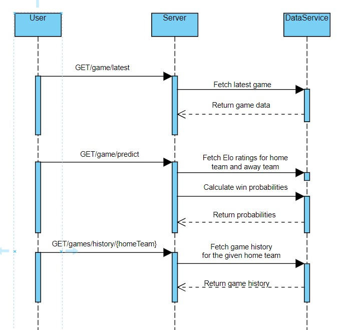

# MLB API Backend using ZIO

## Description

This project involves building a REST API backend using the "Major League Baseball Dataset" from Kaggle. The dataset contains comprehensive data related to Major League Baseball (MLB) games, players, teams, and statistics, including game-by-game Elo ratings and forecasts dating back to 1871.

## Requirements

### Dataset and Technologies

- **Dataset**: The MLB dataset is available in CSV format, and two files are provided:
  - mlb_elo.csv: Contains all data.
  - mlb_elo_latest.csv: Contains data for the latest season.
  The files are available in the Teams group's files tab; no need to register or download from Kaggle.
- **Technologies**: Build the application backend using Scala 3 and leverage the power of ZIO. Use ZIO libraries such as zio-jdbc, zio-streams, zio-json, or zio-http to handle database operations, stream processing, JSON parsing, and HTTP applications.
- 
It appears that you have provided some Scala code that defines data structures for the Major League Baseball (MLB) game data using Scala's opaque types and case classes. The code defines various types, including `HomeTeam`, `HomeScore`, `AwayScore`, `AwayTeam`, `GameDate`, `SeasonYear`, and `EloRating`. Additionally, you have a `Game` case class that combines these types to represent an MLB game with Elo ratings for both the home and away teams.

### Data Structures

The project uses Scala's opaque types to create a type-safe representation of various MLB data attributes. The data structures include:

- `HomeTeam`: Represents the home team of an MLB game.
- `HomeScore`: Represents the score of the home team in an MLB game.
- `AwayScore`: Represents the score of the away team in an MLB game.
- `AwayTeam`: Represents the away team of an MLB game.
- `GameDate`: Represents the date of an MLB game.
- `SeasonYear`: Represents the year of an MLB season.
- `EloRating`: Represents Elo ratings for MLB teams, including the pre-rating, probability, and post-rating.

### Game Data Representation

The core data structure in the project is the `Game` case class. It combines various MLB data attributes to represent a single game. Each `Game` object contains information about the date, season, home team, away team, home score, away score, and Elo ratings for both teams.

The `Game` class also provides a custom decoder to convert data between tuple representation and the `Game` object. This allows for seamless database operations using ZIO and ZIO-JDBC.

## REST API Endpoints

The REST API backend exposes various endpoints to interact with the MLB data. The endpoints will include functionalities to:

1. Retrieve game history, including past game data, scores, and Elo ratings.
2. Make predictions for future games based on Elo ratings and historical data.
3. Optionally, provide an endpoint to trigger the initialization process for the H2 database engine and setup required database schema.
4. 

Here's a short description for the endpoints:

1. **Endpoint: /game/latest/{homeTeam}/{awayTeam}**
   - Method: GET
   - Description: Retrieves the latest game data for a specific home team and away team.
   - Response: Returns JSON data containing the details of the latest game, including the date, season, home team, away team, home score, away score, and Elo ratings for both teams. If no game is found, a "Not Found" response is returned.

2. **Endpoint: /game/predict/{homeTeam}**
   - Method: GET
   - Description: Predicts the win probability for a specific home team in its upcoming game based on the latest Elo rating.
   - Response: Returns the probability of the specified home team winning against its next opponent, along with the Elo ratings of both teams. If the Elo ratings are not available or valid, a "Not Found" response is returned.

3. **Endpoint: /games/count**
   - Method: GET
   - Description: Retrieves the count of games available in the historical data.
   - Response: Returns the count of games as plain text. If no games are found, a "Not Found" response is returned.

4. **Endpoint: /games/history/{homeTeam}**
   - Method: GET
   - Description: Retrieves the historical game data for a specific home team.
   - Response: Returns JSON data containing a list of historical games played by the specified home team. If no historical games are found, a "Not Found" response is returned.



The implementation includes error handling to handle cases where the required data is not available or the SQL queries encounter issues. For example, when attempting to retrieve the latest game data or make predictions without valid Elo ratings, appropriate error responses are returned.

The provided description outlines the functionalities of the API endpoints, and it can be further expanded in the README.md file to include details about the input parameters and response formats for each endpoint. Additionally, you may want to provide information on how to run the API, the required dependencies, and any specific configurations needed to set up the application.

If you have additional details or specifications to add to the README.md file, feel free to include them to provide comprehensive documentation for your MLB API.

## Testing and Functional Properties

To ensure the reliability and correctness of the application, the project will incorporate unit tests using testing frameworks such as ScalaTest or ZIO Test. The emphasis will be on functional programming principles, including immutability, referential transparency, and composability, to enhance code modularity and maintainability.


### Design and Implementation

- **Data Structures**: Design appropriate data structures to represent games, teams, players, and the two ratings systems (ELO and MLB Predictions). Prefer functional programming principles and immutable data structures where possible.
- **Database Initialization**: Implement a mechanism to initialize the H2 database engine at application startup. Use ZIO for managing the initialization process and setting up the required database schema. To process CSV, you can use the tototoshi/scala-csv library.
- **Database Initialization Endpoint**: Optionally, create a dedicated endpoint in your REST API to trigger the database initialization process.
- **Endpoints**: Implement additional endpoints to allow users to query and retrieve game history and make predictions for future games using the MLB dataset. Be creative and explain your motivation in your project README file.
- **Testing**: Write test cases to validate the functionality of your application. Consider using frameworks like ScalaTest or ZIO Test to write unit tests that cover critical components of your codebase.
- **Functional Properties**: Emphasize functional programming principles such as immutability, referential transparency, and composability where applicable. Use appropriate abstractions and design patterns to enhance code modularity and maintainability.

### Deliverables

- Provide Scala 3 code implementing the ZIO application, adhering to the given requirements and expectations.
- Set up a Git repository to manage your application's source code. Ensure that your repository is well-organized, contains appropriate commits, and has a clear README file.
- Document your code, including class and method-level comments, explaining the purpose and functionality of each component.

## Build Configuration

To build and run your project, use the provided build.sbt file. Adjust the dependencies' versions if needed, and make sure to place it in the root directory of your project.*

```scala
val scala3Version = "3.2.2"
val h2Version = "2.1.214"
val scalaCsvVersion = "1.3.10"
val zioVersion = "2.0.6"
val zioSchemaVersion = "0.4.8"
val zioJdbcVersion = "0.0.2"
val zioJsonVersion = "0.5.0"
val zioHtppVersion = "3.0.0-RC2"

lazy val root = (project in file("."))
  .settings(
    name := "mlb-api",
    version := "1.0",
    scalaVersion := scala3Version,
    libraryDependencies ++= Seq(
      "com.h2database" % "h2" % h2Version,
      "dev.zio" %% "zio" % zioVersion,
      "dev.zio" %% "zio-streams" % zioVersion,
      "dev.zio" %% "zio-schema" % zioSchemaVersion,
      "dev.zio" %% "zio-jdbc" % zioJdbcVersion,
      "dev.zio" %% "zio-json" % zioJsonVersion,
      "dev.zio" %% "zio-http" % zioHtppVersion,
      "com.github.tototoshi" %% "scala-csv" % scalaCsvVersion,
    ).map(_ % Compile),
 libraryDependencies ++= Seq(
      "org.scalameta" %% "munit" % "0.7.29"
    ).map(_ % Test)
  )
```

## Skeleton Code

The provided skeleton code is a basic structure for your application. It includes ZIO, ZIO libraries, and an example of initializing the H2 database, reading the CSV, and processing game data. You will need to fill in the placeholders (???) with the appropriate code to handle database operations, retrieve game history, make predictions, and handle other functionalities as per your requirements.

```scala
// rest/src/main/scala/mlb/MlbApi.scala

package mlb

import zio._
import zio.jdbc._
import zio.http._
import com.github.tototoshi.csv._
import java.io.File
import zio.stream.ZStream

// Import other classes and objects as needed

object MlbApi
